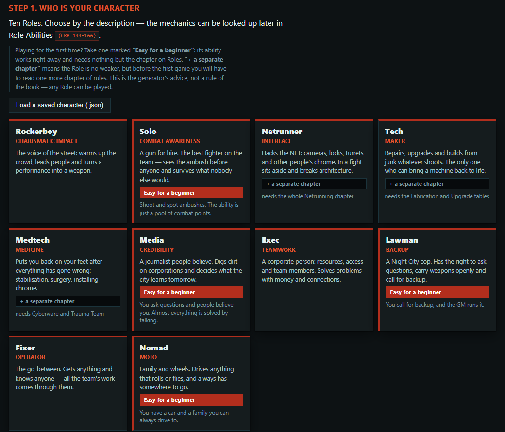

**English** · [Русский](README.ru.md)

# Character Generator for Cyberpunk RED

A character wizard for Cyberpunk RED. One HTML page, no sign-up, works offline.
English and Russian.

**[▶ Open online](https://cellpot.github.io/cpr-character-generator/)**, or download
`generator.html` and open it in a browser.

- All three creation methods of the Core Rulebook, with dice or by hand.
- Derived numbers, a priced gear catalogue, a book page next to every rule.
- Print / PDF, a Markdown note, a `.json` save. The character stays in your browser.

Not a replacement for the books: mechanics and short summaries in our own words.

## Build

`python build.py` rebuilds `generator.html` (Python 3, standard library only). `data/` is
exported from a private project and is not edited here.

Issues welcome; pull requests are not accepted.

## Credits

The Russian terms mostly follow the fan translations of the Cyberpunk RED books. Thanks to
[rustablerpg.ru](https://rustablerpg.ru) and [vk.com/cyberpunk_red_rus](https://vk.com/cyberpunk_red_rus),
the VK group *Cyberpunk RED на русском языке*, @kr45n1y ([t.me/redcyberpunk](https://t.me/redcyberpunk))
and LieSnPeace ([t.me/cyberpunk_red_rus](https://t.me/cyberpunk_red_rus)).

## Legal

Unofficial content provided under the
[Homebrew Content Policy](https://rtalsoriangames.com/homebrew-content-policy/) of
R. Talsorian Games; not approved or endorsed by RTG. Cyberpunk is a registered trademark of
CD PROJEKT S.A.; Cyberpunk RED and its rules belong to R. Talsorian Games. No book text is
copied: the page uses random tables, names and numbers, which the policy allows, and
descriptions written anew.

Code: [MIT](LICENSE) (game material excluded). Play font: SIL OFL 1.1,
[`LICENSES/Play-OFL.txt`](LICENSES/Play-OFL.txt).
